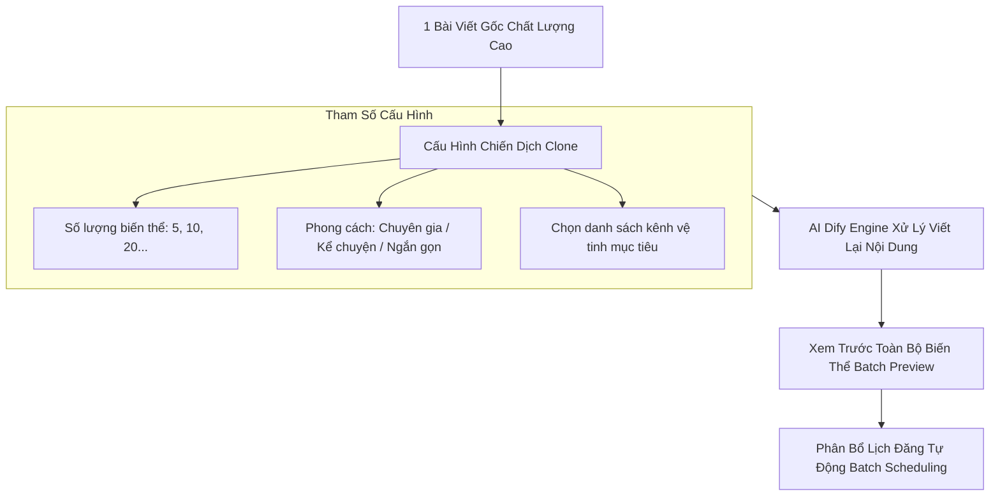

# Chiến Dịch Nhân Bản Nội Dung (Content Clones)

Giải pháp nhân bản 1 bài viết chất lượng cao thành hàng chục bài viết biến thể bằng AI để phủ sóng toàn bộ hệ thống kênh vệ tinh.

---

## Các Bước Thực Hiện Chiến Dịch:

1. **Chọn bài viết gốc:** Truy cập **Content Clones** (`/content-clones`) -> Chọn bài viết có tương tác tốt nhất.
2. **Thiết lập số lượng & phong cách:** Chọn số lượng bài biến thể cần tạo và phong cách diễn đạt.
3. **Xem trước (Batch Preview):** Kiểm tra danh sách các bài viết do AI tạo ra và chỉnh sửa nếu cần.
4. **Lên lịch phân bổ (Batch Scheduling):** Chọn khung thời gian (ví dụ: *Đăng rải đều trong 7 ngày vào 09:00 và 15:00*). Hệ thống sẽ tự động xếp lịch vào các kênh vệ tinh tương ứng.
