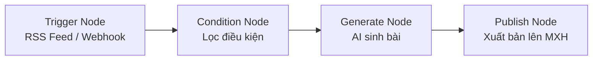

# Trình Dựng Quy Trình Tự Động Kéo Thả (Visual Automations)

Xây dựng các luồng tự động hóa marketing không cần lập trình thông qua giao diện dạng Node trực quan.

- **Trigger Node:** Kích hoạt theo lịch biểu, Webhook hoặc RSS Feed bài viết mới.
- **Condition Node:** Rẽ nhánh luồng xử lý theo từ khóa hoặc chuyên mục.
- **Generate Node:** Sử dụng AI để tóm tắt và tạo bài đăng mạng xã hội.
- **Publish Node:** Đăng bài tự động lên các kênh được chọn.
