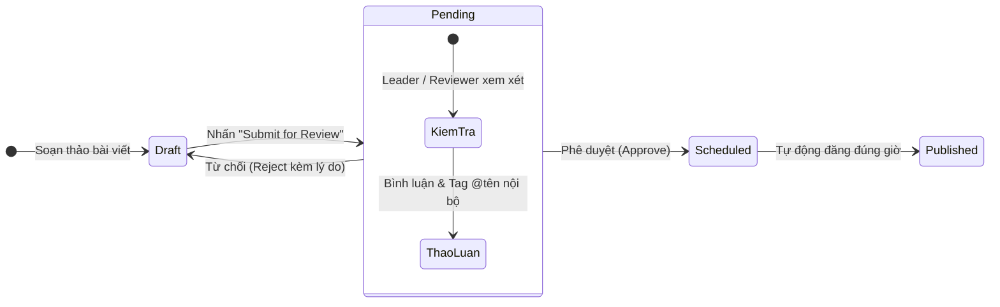

# Quy Trình Gửi Duyệt & Phê Duyệt Bài Viết

Đảm bảo kiểm soát chất lượng nội dung tuyệt đối trước khi phát hành.

---

## Chi Tiết Thao Tác

1. **Gửi duyệt bài:** Sau khi hoàn thành soạn thảo, Editor nhấp **Submit for Review**.
2. **Kiểm tra bài viết:** Reviewer mở bài viết từ danh sách chờ duyệt, kiểm tra nội dung và Live Preview.
3. **Phê duyệt hoặc Từ chối:**
   - Nếu duyệt: Bấm **Phê Duyệt (Approve)**. Bài viết được khóa lịch và tự động đăng đúng giờ.
   - Nếu cần chỉnh sửa: Bấm **Từ Chối (Reject)** và nhập lý do phản hồi để Editor cập nhật lại.
