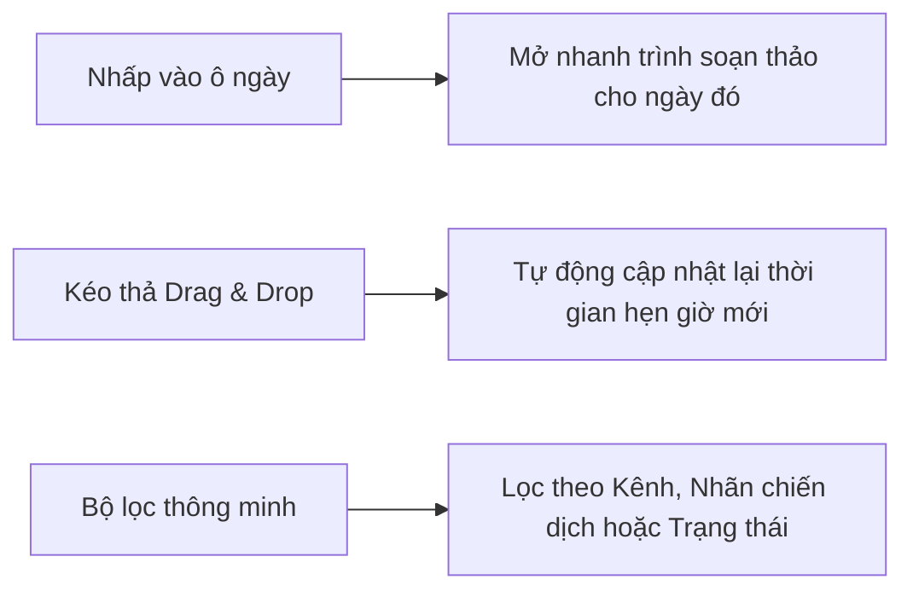

# Lịch Xuất Bản Trực Quan (Visual Calendar)

Quản lý toàn diện kế hoạch phát hành nội dung theo giao diện Lịch trực quan.

---

## Các Tính Năng Nổi Bật Trên Lịch

### 1. Kéo Thả Dời Lịch Đăng (Drag & Drop)
Khi cần điều chỉnh kế hoạch, người dùng chỉ cần giữ chuột và kéo bài viết sang ngày hoặc khung giờ khác trên lịch.

### 2. Trạng Thái Bài Viết Thể Hiện Bằng Màu Sắc
- **Nháp (Draft):** Bài viết đang phát triển.
- **Chờ duyệt (Pending):** Đã gửi lên cấp trên chờ phê duyệt.
- **Đã lên lịch (Scheduled):** Sẵn sàng xuất bản tự động theo lịch.
- **Đã xuất bản (Published):** Đã phát hành thành công lên mạng xã hội.
- **Lỗi xuất bản (Failed):** Bài đăng gặp sự cố API kèm thông báo lỗi chi tiết.
