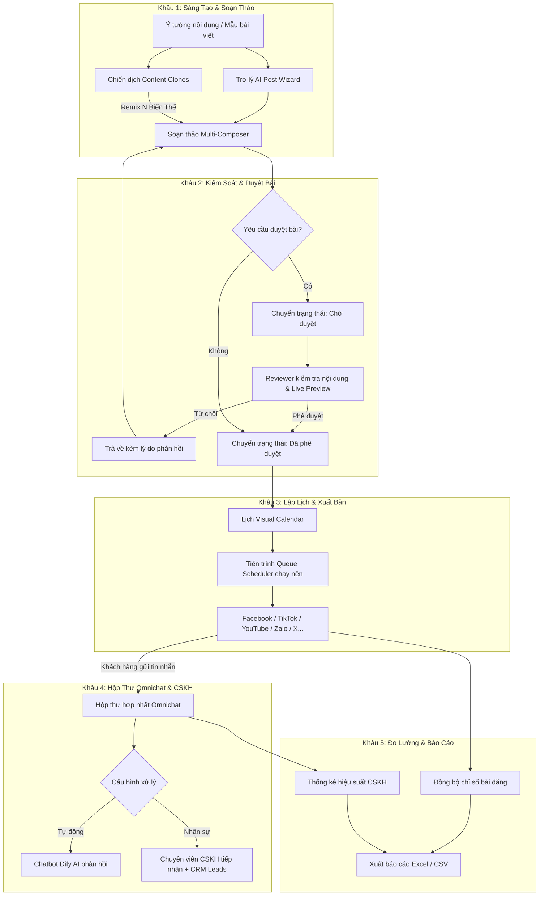

# Quy Trình Vận Hành Tổng Thể

Sơ đồ dưới đây mô tả luồng dữ liệu và nghiệp vụ xuyên suốt giữa các phân hệ trong hệ thống King Hub Social.

```mermaid
flowchart TD
    subgraph SANG_TAO["Khâu 1: Sáng Tạo & Soạn Thảo"]
        A1[Ý tưởng nội dung / Mẫu bài viết] --> A2[Trợ lý AI Post Wizard]
        A2 --> A3[Soạn thảo Multi-Composer]
        A1 --> A4[Chiến dịch Content Clones]
        A4 -->|Remix N Biến Thể| A3
    end

    subgraph DUYET_BAI["Khâu 2: Kiểm Soát & Duyệt Bài"]
        A3 --> B1{Yêu cầu duyệt bài?}
        B1 -->|Có| B2[Chuyển trạng thái: Chờ duyệt]
        B2 --> B3[Reviewer kiểm tra nội dung & Live Preview]
        B3 -->|Từ chối| B4[Trả về kèm lý do phản hồi]
        B4 --> A3
        B3 -->|Phê duyệt| B5[Chuyển trạng thái: Đã phê duyệt]
        B1 -->|Không| B5
    end

    subgraph XUAT_BAN["Khâu 3: Lập Lịch & Xuất Bản"]
        B5 --> C1[Lịch Visual Calendar]
        C1 --> C2[Tiến trình Queue Scheduler chạy nền]
        C2 --> C3[Facebook / TikTok / YouTube / Zalo / X...]
    end

    subgraph TUONG_TAC["Khâu 4: Hộp Thư Omnichat & CSKH"]
        C3 -->|Khách hàng gửi tin nhắn| D1[Hộp thư hợp nhất Omnichat]
        D1 --> D2{Cấu hình xử lý}
        D2 -->|Tự động| D3[Chatbot Dify AI phản hồi]
        D2 -->|Nhân sự| D4[Chuyên viên CSKH tiếp nhận + CRM Leads]
    end

    subgraph BAO_CAO["Khâu 5: Đo Lường & Báo Cáo"]
        C3 --> E1[Đồng bộ chỉ số bài đăng]
        D1 --> E2[Thống kê hiệu suất CSKH]
        E1 --> E3[Xuất báo cáo Excel / CSV]
        E2 --> E3
    end
```
