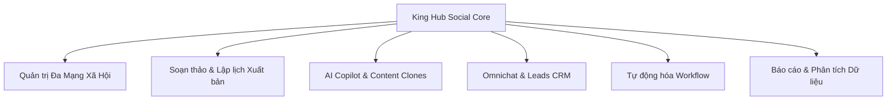

# Giới Thiệu Hệ Thống King Hub Social

**King Hub Social** là nền tảng quản trị truyền thông đa kênh, sáng tạo nội dung tự động bằng trí tuệ nhân tạo (AI) và chăm sóc khách hàng tập trung (Omnichannel Chat). Hệ thống được thiết kế theo tiêu chuẩn doanh nghiệp, tối ưu cho các thương hiệu, đội ngũ Marketing và Agency quản lý nhiều khách hàng.

---

## Các Module Chức Năng Chính

### 1. Quản Trị Đa Kênh Mạng Xã Hội
Kết nối trực tiếp qua API chính thức của hơn 12 nền tảng: Facebook, Instagram, Threads, TikTok, YouTube, LinkedIn, X (Twitter), Pinterest, Bluesky, Mastodon, Telegram, Discord, Zalo OA, Shopee và Lazada.

### 2. Soạn Thảo & Lập Lịch Xuất Bản
Trình soạn thảo đa kênh (Multi-Composer) cho phép tùy biến nội dung theo từng mạng xã hội trên cùng một giao diện, đi kèm công cụ xem trước thực tế (Live Preview), cắt ảnh theo tỷ lệ chuẩn và lên lịch trực quan dạng Calendar (Tháng, Tuần, Ngày).

### 3. Sáng Tạo AI & Nhân Bản Nội Dung (Content Clones)
Ứng dụng mô hình AI và Dify Engine để tạo bài viết từ ý tưởng, tối ưu nội dung theo Hồ sơ thương hiệu (Brand Voice) và nhân bản một bài viết gốc thành hàng chục biến thể khác nhau để phân phối tự động trên hệ thống kênh vệ tinh.

### 4. Hộp Thư Hợp Nhất & CSKH (Omnichat)
Tập trung toàn bộ tin nhắn từ Facebook Messenger, Zalo OA, Shopee, Lazada và Telegram về một màn hình làm việc duy nhất. Tích hợp tính năng phân công nhân sự, gắn thẻ phân loại, quản lý thông tin khách hàng (CRM Leads) và chatbot AI tự động phản hồi.

### 5. Kiểm Soát Quyền Hạn & Quy Trình Duyệt Bài
Hệ thống phân quyền 3 cấp độ: Quản trị viên (Admin), Người kiểm duyệt (Reviewer) và Chuyên viên nội dung (Editor), đảm bảo mọi nội dung đều được kiểm soát chất lượng trước khi phát hành ra công chúng.
