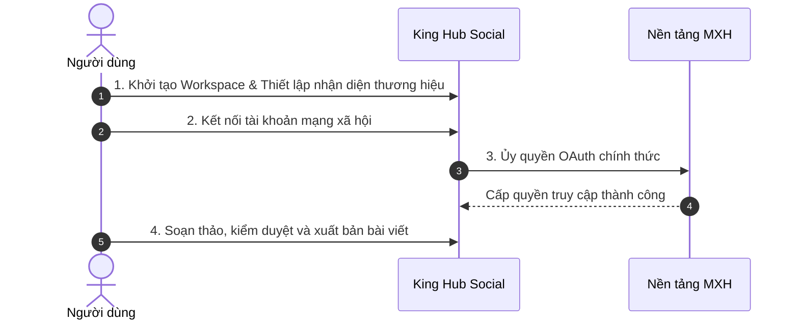

# Hướng Dẫn Thiết Lập Ban Đầu

Quy trình thiết lập gồm 4 bước cơ bản để đưa hệ thống vào vận hành thực tế.

---

## Chi Tiết Các Bước Triển Khai

### Bước 1: Khởi Tạo Không Gian Làm Việc (Workspace)
1. Sau khi đăng nhập, truy cập menu **Workspace** ở góc trên bên trái -> Chọn **Tạo Workspace mới**.
2. Nhập tên thương hiệu hoặc tên dự án, sau đó tải lên logo đại diện.
3. Truy cập **Cài đặt Workspace > Brand Profile** để cấu hình tính cách thương hiệu, phong cách ngôn ngữ và bảng màu nhận diện.

### Bước 2: Kết Nối Tài Khoản Mạng Xã Hội
1. Điều hướng đến mục **Tài khoản mạng xã hội** (`/accounts`).
2. Chọn biểu tượng nền tảng cần kết nối (Facebook, TikTok, Zalo OA, Instagram...).
3. Thực hiện đăng nhập và phê duyệt quyền hạn trong cửa sổ OAuth của nền tảng.
4. Chọn danh sách Trang / Kênh cụ thể muốn đưa vào hệ thống -> Nhấn **Hoàn tất kết nối**.

### Bước 3: Soạn Thảo & Lập Lịch Bài Viết
1. Nhấp nút **Tạo bài viết mới** tại thanh điều hướng chính.
2. Chọn các kênh mục tiêu cần đăng bài.
3. Nhập văn bản, đính kèm hình ảnh/video và tùy chỉnh định dạng theo từng kênh tại khung Live Preview.
4. Chọn hình thức: **Đăng ngay (Publish Now)** hoặc **Hẹn giờ (Schedule)**.

### Bước 4: Kiểm Duyệt & Theo Dõi Trạng Thái
- Nếu tài khoản được phân quyền cần phê duyệt, bài viết sẽ được gửi vào danh sách chờ duyệt của Quản trị viên/Trưởng nhóm.
- Sau khi được phê duyệt, bài viết sẽ hiển thị trên Lịch xuất bản và tự động được hệ thống đăng tải đúng giờ.
