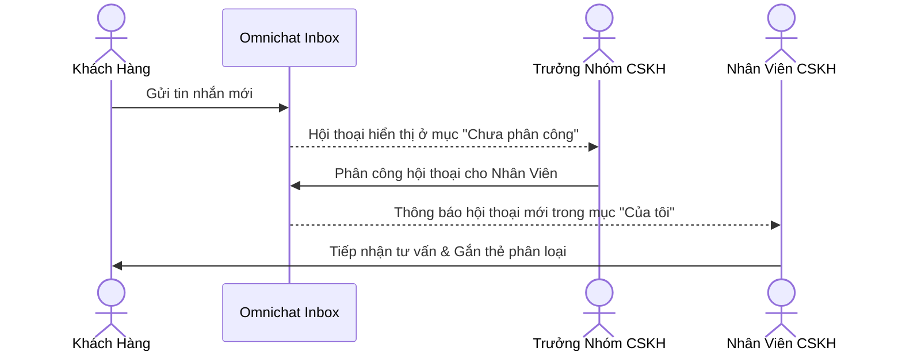

# Gắn Thẻ Phân Loại & Phân Công Nhân Viên CSKH

Quy trình điều phối hội thoại chuyên nghiệp trong môi trường nhóm CSKH.

---

## 1. Gắn Thẻ Hội Thoại (Tags)
- Tạo các thẻ phân loại màu sắc: *Khách mới, Đang tư vấn, Đã chốt đơn, Khiếu nại*.
- Hỗ trợ gắn nhiều thẻ trên cùng một cuộc trò chuyện để dễ dàng lọc và quản lý.

## 2. Phân Công Nhân Sự (Agent Assignment)
- Trưởng nhóm chỉ định nhân viên phụ trách cuộc trò chuyện để tránh trùng lặp.
- Nhân viên có thể lọc xem riêng mục **Hội thoại của tôi**.
