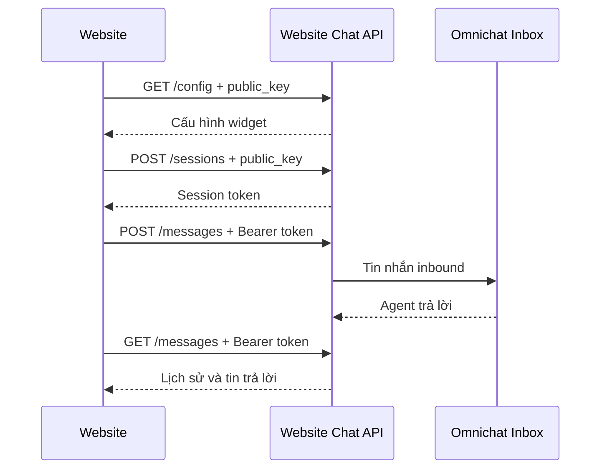

# API Website Live Chat

import Tabs from '@theme/Tabs';
import TabItem from '@theme/TabItem';

:::tip Chào mừng Quý Đối Tác (Developers)
Tài liệu này cung cấp các đặc tả API kỹ thuật để tích hợp tính năng **Website Live Chat** vào nền tảng của bạn (CRM, CMS, ERP hoặc các hệ thống tùy chỉnh). 
:::

Website Chat API cho phép website lấy cấu hình widget, tạo phiên và trao đổi tin nhắn với Omnichat Inbox. API dùng JSON qua HTTPS với base URL:

```text
https://autopost.tnicorporation.com/api/website-chat/v1
```

## Xác thực và bảo mật

| Loại | Cách gửi | Dùng cho |
| --- | --- | --- |
| Public key | Query `public_key` hoặc header `X-Website-Chat-Key` | Lấy cấu hình, tạo phiên |
| Session token | `Authorization: Bearer wc_session_...` | Đọc/gửi tin, kết thúc phiên |

Public key bắt đầu bằng `wc_pk_`. Đây không phải secret nhưng chỉ hoạt động từ origin đã được quản trị viên cho phép. Session token là dữ liệu nhạy cảm, không ghi log hoặc gửi sang hệ thống khác.

Header `Origin` phải khớp chính xác allowlist, bao gồm scheme, hostname và port. `https://shop.example.com` khác `https://www.shop.example.com`.



## Lấy cấu hình widget

```http
GET /api/website-chat/v1/config?public_key=wc_pk_xxx
Origin: https://shop.example.com
Accept: application/json
```

```bash
curl 'https://autopost.tnicorporation.com/api/website-chat/v1/config?public_key=wc_pk_REPLACE_ME' \
  --header 'Origin: https://shop.example.com' \
  --header 'Accept: application/json'
```

Response `200 OK`:

```json
{
  "channel": { "id": "019...", "name": "Website chính" },
  "branding": {
    "primary_color": "#2563EB",
    "position": "right",
    "welcome_message": "Xin chào! Chúng tôi có thể giúp gì cho bạn?",
    "offline_message": "Vui lòng để lại lời nhắn.",
    "privacy_url": "https://shop.example.com/privacy"
  },
  "capabilities": ["messages", "realtime"]
}
```

## Tạo phiên trò chuyện

```http
POST /api/website-chat/v1/sessions?public_key=wc_pk_xxx
Origin: https://shop.example.com
Content-Type: application/json
```

| Trường | Kiểu | Bắt buộc | Giới hạn |
| --- | --- | --- | --- |
| `visitor_id` | UUID | Có | Định danh ổn định do website tạo |
| `name` | string | Không | 120 ký tự |
| `email` | email | Không | 255 ký tự |
| `locale` | string | Không | 12 ký tự, mặc định `vi` |
| `context` | object | Không | 20 trường, mỗi giá trị 500 ký tự |

```json
{
  "visitor_id": "4eaf609a-8656-45ba-b7e7-9d728d95fb93",
  "name": "Nguyễn An",
  "email": "an@example.com",
  "locale": "vi",
  "context": {
    "page_url": "https://shop.example.com/products/coffee",
    "page_title": "Cà phê rang xay"
  }
}
```

Response `201 Created`:

```json
{
  "token": "wc_session_REPLACE_ME",
  "session_id": "019...",
  "conversation_id": "019...",
  "expires_at": "2026-09-24T08:00:00+00:00"
}
```

Phiên có hiệu lực 30 ngày, trừ khi bị kết thúc hoặc public key được xoay.

## Gửi tin nhắn

```http
POST /api/website-chat/v1/messages
Origin: https://shop.example.com
Authorization: Bearer wc_session_xxx
Content-Type: application/json
```

```json
{
  "client_id": "5c275b2c-3ff4-42e1-80fd-70f5334783fe",
  "body": "Tôi cần tư vấn sản phẩm này."
}
```

`client_id` là UUID duy nhất cho mỗi tin. Retry cùng `client_id` không tạo tin trùng. `body` tối đa 5.000 ký tự.

Response `201 Created`:

```json
{
  "message": {
    "id": "019...",
    "client_id": "5c275b2c-3ff4-42e1-80fd-70f5334783fe",
    "direction": "inbound",
    "type": "text",
    "body": "Tôi cần tư vấn sản phẩm này.",
    "status": "sent",
    "sent_at": "2026-08-25T08:00:00+00:00",
    "created_at": "2026-08-25T08:00:00+00:00"
  }
}
```

## Đọc tin nhắn

```http
GET /api/website-chat/v1/messages?after=2026-08-25T08:00:00Z
Origin: https://shop.example.com
Authorization: Bearer wc_session_xxx
Accept: application/json
```

`after` là ISO 8601 và không bắt buộc. API trả tối đa 200 tin theo thứ tự cũ đến mới; tin nội bộ của agent không được trả về widget.

```json
{
  "messages": [
    {
      "id": "019...",
      "client_id": null,
      "direction": "outbound",
      "type": "text",
      "body": "Chào bạn, mình có thể hỗ trợ ngay.",
      "status": "sent",
      "sent_at": "2026-08-25T08:01:00+00:00",
      "created_at": "2026-08-25T08:01:00+00:00"
    }
  ]
}
```

## Kết thúc phiên

```http
DELETE /api/website-chat/v1/sessions/current
Origin: https://shop.example.com
Authorization: Bearer wc_session_xxx
Accept: application/json
```

```json
{ "ended": true }
```

Sau khi kết thúc, session token không thể đọc hoặc gửi thêm tin.

## Mã lỗi

| HTTP | Ý nghĩa | Cách xử lý |
| --- | --- | --- |
| `401` | Session thiếu, sai, hết hạn hoặc khác origin | Xóa token phía client và tạo phiên mới |
| `403` | Public key sai, kênh tắt hoặc origin không được phép | Kiểm tra kênh và allowlist |
| `422` | Payload không hợp lệ | Đọc object `errors` và sửa payload |
| `429` | Quá 120 request/phút | Backoff trước khi retry |
| `500` | Lỗi máy chủ | Retry có backoff và báo thời điểm xảy ra lỗi |

## Ví dụ Tích Hợp (Code Snippets)

Dưới đây là ví dụ cách tạo phiên và gửi tin nhắn đầu tiên bằng nhiều ngôn ngữ phổ biến:

<Tabs>
  <TabItem value="javascript" label="JavaScript (Fetch)" default>
    ```javascript
    const apiBase = 'https://autopost.tnicorporation.com/api/website-chat/v1';
    const publicKey = 'wc_pk_REPLACE_ME';

    // 1. Tạo phiên (Session)
    const response = await fetch(
      `${apiBase}/sessions?public_key=${encodeURIComponent(publicKey)}`,
      {
        method: 'POST',
        headers: { 'Content-Type': 'application/json' },
        body: JSON.stringify({ visitor_id: crypto.randomUUID(), locale: 'vi' }),
      }
    );
    const session = await response.json();

    // 2. Gửi tin nhắn đầu tiên
    await fetch(`${apiBase}/messages`, {
      method: 'POST',
      headers: {
        Authorization: `Bearer ${session.token}`,
        'Content-Type': 'application/json',
      },
      body: JSON.stringify({
        client_id: crypto.randomUUID(),
        body: 'Xin chào Omnichat!',
      }),
    });
    ```
  </TabItem>
  <TabItem value="nodejs" label="Node.js (Axios)">
    ```javascript
    const axios = require('axios');
    const { v4: uuidv4 } = require('uuid');

    const apiBase = 'https://autopost.tnicorporation.com/api/website-chat/v1';
    const publicKey = 'wc_pk_REPLACE_ME';

    async function startChat() {
      // 1. Tạo phiên (Session)
      const sessionRes = await axios.post(`${apiBase}/sessions`, 
        { visitor_id: uuidv4(), locale: 'vi' },
        { params: { public_key: publicKey } }
      );
      const token = sessionRes.data.token;

      // 2. Gửi tin nhắn đầu tiên
      await axios.post(`${apiBase}/messages`, 
        { client_id: uuidv4(), body: 'Xin chào từ Node.js!' },
        { headers: { Authorization: `Bearer ${token}` } }
      );
    }
    startChat();
    ```
  </TabItem>
  <TabItem value="php" label="PHP (Guzzle)">
    ```php
    <?php
    require 'vendor/autoload.php';
    use GuzzleHttp\Client;
    use Ramsey\Uuid\Uuid;

    $client = new Client(['base_uri' => 'https://autopost.tnicorporation.com/api/website-chat/v1/']);
    $publicKey = 'wc_pk_REPLACE_ME';
    $visitorId = Uuid::uuid4()->toString();

    // 1. Tạo phiên (Session)
    $sessionRes = $client->post('sessions', [
        'query' => ['public_key' => $publicKey],
        'json' => ['visitor_id' => $visitorId, 'locale' => 'vi']
    ]);
    $token = json_decode($sessionRes->getBody(), true)['token'];

    // 2. Gửi tin nhắn đầu tiên
    $client->post('messages', [
        'headers' => ['Authorization' => 'Bearer ' . $token],
        'json' => [
            'client_id' => Uuid::uuid4()->toString(),
            'body' => 'Xin chào từ PHP!'
        ]
    ]);
    ```
  </TabItem>
</Tabs>

## Widget và website demo

Nếu không tự xây giao diện, nhúng widget có sẵn:

```html
<script
  src="https://autopost.tnicorporation.com/website-chat/widget.js"
  data-public-key="wc_pk_REPLACE_ME"
  async
></script>
```

Thử public key tại [Website Chat Demo](https://autopost.tnicorporation.com/website-chat/demo.html). Trước khi thử, thêm `https://autopost.tnicorporation.com` vào allowlist của kênh.
