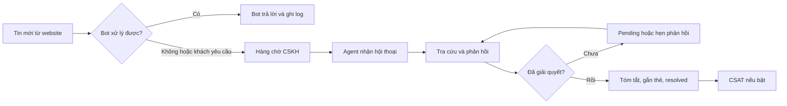

# Vận hành Website Live Chat

## Luồng xử lý chuẩn

## 1. Tiếp nhận hội thoại

Trong **Omnichat → Hộp thư**, lọc kênh **Website** và ưu tiên:

1. Hội thoại vượt SLA hoặc có mức ưu tiên cao.
2. Khiếu nại, thanh toán và dấu hiệu rủi ro.
3. Hội thoại chưa phân công theo thứ tự đến.

Agent bấm **Nhận xử lý** trước khi trả lời. Nếu hệ thống cho phép nhiều người xem, chỉ người được giao nên gửi phản hồi để tránh trả lời trùng.

## 2. Xác minh khách hàng

- Khách ẩn danh hoặc chỉ khai báo trong form được coi là **chưa xác minh**.
- Không đọc lại thông tin tài khoản nhạy cảm chỉ dựa trên tên/email khách nhập.
- Khi cần xử lý tài khoản/đơn hàng, dùng luồng xác minh đã được doanh nghiệp phê duyệt.
- Không yêu cầu khách gửi OTP, mật khẩu hoặc thông tin thẻ trong chat.

## 3. Trả lời

- Chào khách và cho biết tên/đội ngũ đang hỗ trợ.
- Đọc lịch sử và ngữ cảnh trang trước khi hỏi lại.
- Dùng câu trả lời nhanh như một bản nháp, kiểm tra trước khi gửi.
- Nếu cần thời gian tra cứu, chuyển `pending` và nói rõ thời gian dự kiến.
- Gửi link từ domain đáng tin cậy; không tải tệp lạ từ khách về thiết bị cá nhân.

## 4. Chuyển giao

Khi chuyển agent/team, ghi chú nội bộ gồm vấn đề chính, bước đã thực hiện, dữ liệu còn cần xác minh và thời điểm phản hồi tiếp theo. Ghi chú nội bộ phải có màu và nhãn riêng; tuyệt đối không gửi nhầm cho khách.

## 5. Trạng thái hội thoại

| Trạng thái | Khi sử dụng |
| --- | --- |
| Open | Đang cần agent xử lý hoặc chờ phản hồi nội bộ ngắn |
| Pending | Đang chờ khách hoặc chờ mốc phản hồi đã hẹn |
| Resolved | Yêu cầu đã xử lý và không còn hành động mở |
| Spam | Nội dung rác/lạm dụng; áp dụng block theo chính sách |

Khách gửi tin mới vào hội thoại `resolved` sẽ mở lại hoặc tạo phiên mới theo chính sách lưu trữ; lịch sử vẫn liên kết với cùng contact nếu nhận diện hợp lệ.

## 6. Kết thúc và CSAT

Trước khi resolve:

- Tóm tắt kết quả cho khách.
- Gắn thẻ đúng chủ đề/kết quả.
- Cập nhật hồ sơ lead nếu khách đã đồng ý và có dữ liệu phù hợp.
- Xóa dữ liệu nhạy cảm gửi nhầm theo quyền và quy trình audit.
- Gửi khảo sát CSAT tối đa một lần cho mỗi phiên đủ điều kiện.

## 7. SLA và chỉ số vận hành

| Chỉ số | Ý nghĩa |
| --- | --- |
| First response time | Từ tin đầu tiên của khách đến phản hồi người/bot hợp lệ đầu tiên |
| Assignment time | Từ lúc vào hàng chờ đến khi agent nhận |
| Resolution time | Từ lúc mở đến khi resolved, trừ thời gian pending nếu chính sách quy định |
| Abandonment rate | Khách rời đi trước khi được hỗ trợ |
| Reopen rate | Tỷ lệ hội thoại mở lại sau resolved |
| CSAT | Điểm hài lòng sau hỗ trợ |
| Bot containment | Tỷ lệ phiên bot giải quyết mà không cần người thật |

Không dùng số lượng tin nhắn đơn thuần để đánh giá agent; cần xem chất lượng, độ khó và CSAT.

## 8. Xử lý sự cố

### Widget mất kết nối

Thông báo khách, giữ draft ở client và retry có backoff. Agent không nên gửi liên tục nếu trạng thái delivery chưa rõ.

### Hàng chờ tăng đột biến

Tạm tắt lời mời chat chủ động, tăng nhân sự trực, dùng banner thông báo và ưu tiên hội thoại rủi ro cao.

### Spam hoặc lạm dụng

Rate-limit theo nhiều tín hiệu, cho phép block có thời hạn và giữ bằng chứng audit. Không chặn diện rộng chỉ dựa vào một IP dùng chung.

### Lộ khóa hoặc nghi rò rỉ dữ liệu

Thu hồi/xoay khóa, ngừng kênh nếu cần, giữ log, đánh giá phạm vi ảnh hưởng và thực hiện quy trình thông báo sự cố của doanh nghiệp.
