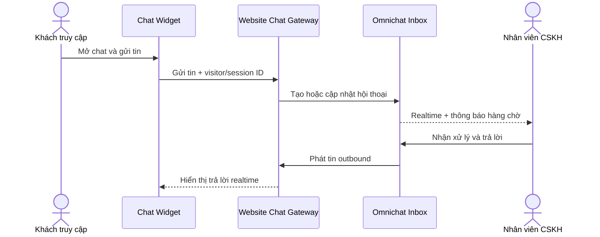

# Website Live Chat cho King Hub Social

Website Live Chat là kênh trò chuyện được nhúng trực tiếp trên website doanh nghiệp. Tin nhắn của khách truy cập được đưa vào **Hộp thư Omnichat** để đội CSKH tiếp nhận, phân công, gắn thẻ và lưu hồ sơ khách hàng cùng các kênh khác.

:::info Cách đọc bộ tài liệu
Bộ tài liệu này là đặc tả riêng cho King Hub Social, tham khảo mô hình live chat và hộp thư hợp nhất của OmiChat. Đây không phải tài liệu API do OmiChat phát hành và không khẳng định tương thích với API của nhà cung cấp OmiChat.
:::

## Mục tiêu

- Khách có thể hỏi đáp ngay trên website mà không cần mở ứng dụng khác.
- Nhân viên xử lý hội thoại website trong cùng Omnichat Inbox.
- Nhận diện nguồn trang, chiến dịch và hành trình cơ bản của khách.
- Giữ xuyên suốt một cuộc hội thoại khi khách chuyển trang hoặc quay lại website.
- Cho phép chatbot trả lời bước đầu và chuyển giao cho người thật khi cần.
- Bảo vệ dữ liệu cá nhân, chống spam và cô lập dữ liệu giữa các workspace.

## Phạm vi theo giai đoạn

| Giai đoạn | Phạm vi |
| --- | --- |
| MVP hiện tại | Widget nổi, nhắn tin văn bản, polling gần realtime, khóa công khai, domain allowlist, phiên khách, phân công agent, gắn thẻ, lịch sử phiên và responsive |
| Giai đoạn 2 | Ảnh/tệp, câu trả lời nhanh, chatbot theo kịch bản, đánh giá CSAT, đồng bộ lead CRM và báo cáo nâng cao |
| Giai đoạn 3 | AI Agent có kiểm soát, chủ động mời chat theo hành vi, đồng duyệt/browse hỗ trợ và tích hợp hệ thống nghiệp vụ |

## Các vai trò

| Vai trò | Trách nhiệm |
| --- | --- |
| Khách truy cập | Mở widget, cung cấp thông tin tối thiểu, gửi/nhận tin và kết thúc chat |
| Nhân viên CSKH | Tiếp nhận, trả lời, ghi chú, gắn thẻ và cập nhật hồ sơ |
| Trưởng nhóm | Theo dõi hàng chờ, phân công, chuyển agent và kiểm soát SLA |
| Quản trị workspace | Tạo kênh website, cấu hình widget, domain, giờ làm việc và quyền truy cập |
| Kỹ thuật website | Nhúng script, truyền ngữ cảnh đã cho phép và cấu hình CSP |

## Luồng tổng quát

## Nguyên tắc sản phẩm

- Website Chat là một **channel** của Omnichat, không xây hộp thư quản trị riêng.
- Mỗi website có khóa công khai và danh sách domain được phép; secret không đưa vào trình duyệt.
- Không coi tên/email do trình duyệt gửi lên là danh tính đã xác minh.
- Bot phải tự giới thiệu là tự động; khi chuyển người thật phải giữ nguyên lịch sử.
- Khi mất kết nối, widget giữ bản nháp và hiển thị trạng thái rõ ràng.
- Chỉ thu thập dữ liệu cần thiết và thông báo cho khách về chính sách quyền riêng tư.

## Tài liệu trong bộ này

1. [Cấu hình dành cho quản trị viên](./admin-setup.md)
2. [Tích hợp widget vào website](./widget-integration.md)
3. [Quy trình vận hành CSKH](./operations.md)
4. [Đặc tả kỹ thuật và nghiệm thu](./technical-specification.md)

## Nguồn tham khảo sản phẩm

- [OmiChat Việt Nam – Omnichannel & Customer Engagement](https://omichat.vn/): giới thiệu Live Chat, Form, Chatbot và API tích hợp trong hộp thư đa kênh.
- [Omnichat – Website Live Chat](https://www.omnichat.ai/web-livechat/): mô hình live chat tập trung, chatbot và theo dõi dữ liệu hành vi.

Các nguồn được đối chiếu ngày **25/08/2026**. Chi tiết triển khai trong bộ tài liệu này là thiết kế của King Hub Social.
