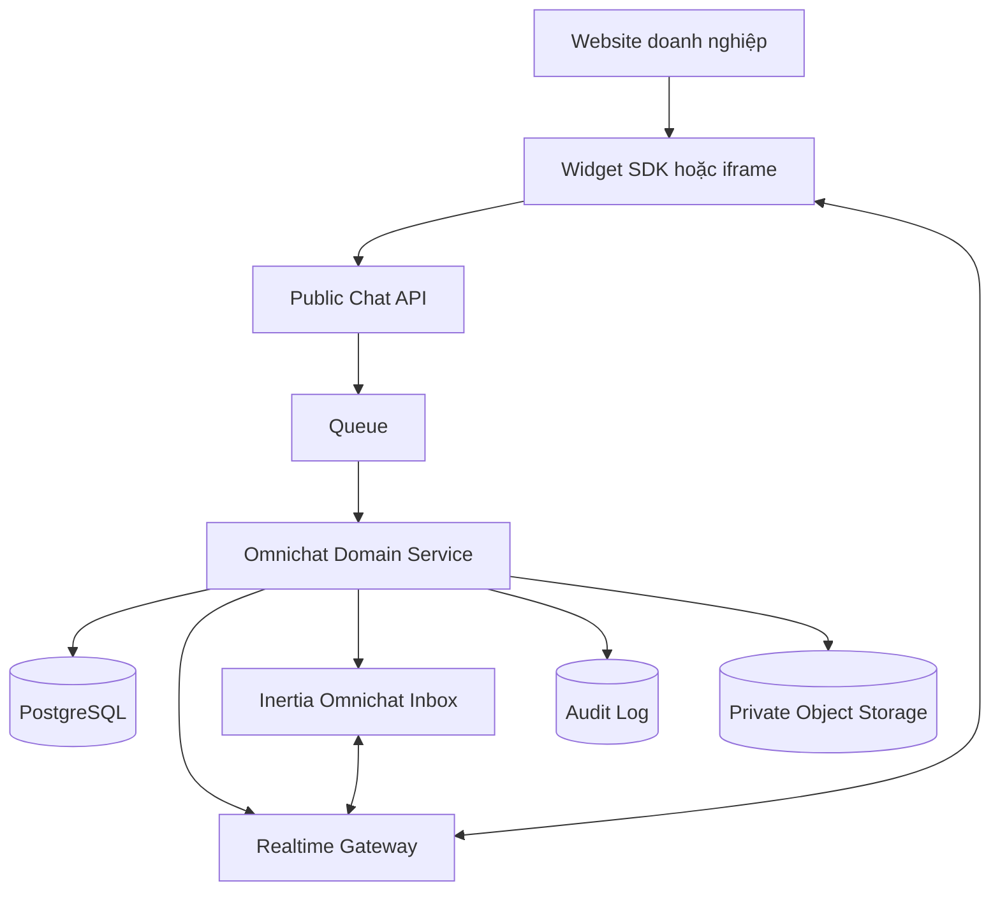

# Đặc tả kỹ thuật Website Live Chat

Tài liệu này mô tả kiến trúc mục tiêu để đội sản phẩm, backend, frontend, QA và vận hành thống nhất trước khi triển khai.

## 1. Kiến trúc



Public Chat API chỉ nhận khóa công khai và token phiên ngắn hạn. Inbox nội bộ dùng session/policy hiện có. Mọi resource phải giới hạn theo `current_workspace_id` ở phía server.

## 2. Mô hình dữ liệu bổ sung

Tái sử dụng `omnichat_channels`, `omnichat_contacts`, `omnichat_conversations` và `omnichat_messages`. Bổ sung domain website chat theo nhu cầu.

### `omnichat_webchat_sites`

```text
id uuid PK
workspace_id uuid FK indexed
channel_id uuid FK unique
public_key_hash varchar unique
name varchar
authorized_origins json
branding json
pre_chat_form json
business_hours json
privacy_url text nullable
status varchar                 active|disabled|compromised
key_rotated_at timestamp nullable
timestamps
```

Không lưu public key dạng rõ nếu có thể xác minh bằng hash. Secret ký danh tính được mã hóa hoặc quản lý trong secret store.

### `omnichat_webchat_sessions`

```text
id uuid PK
workspace_id uuid FK indexed
site_id uuid FK indexed
conversation_id uuid FK indexed
visitor_id_hash varchar indexed
identity_status varchar        anonymous|claimed|verified
identity_subject varchar nullable
locale varchar nullable
user_agent_summary json nullable
first_page_url text nullable
last_page_url text nullable
utm json nullable
connected_at timestamp nullable
last_seen_at timestamp nullable
ended_at timestamp nullable
expires_at timestamp
timestamps
```

Không lưu raw IP lâu hơn nhu cầu bảo mật hợp pháp. Nếu dùng IP cho chống spam, ưu tiên hash/prefix và retention ngắn.

## 3. Public API đề xuất

Prefix có version, ví dụ `/api/webchat/v1`. Tên route cuối cùng phải dùng Wayfinder cho giao diện nội bộ; SDK công khai có hợp đồng độc lập.

| Method | Endpoint | Mục đích |
| --- | --- | --- |
| `POST` | `/sessions` | Tạo hoặc khôi phục phiên sau khi kiểm tra origin và public key |
| `GET` | `/config` | Lấy branding, form, giờ làm việc và capabilities công khai |
| `GET` | `/messages` | Phân trang lịch sử được phép của phiên |
| `POST` | `/messages` | Gửi tin với `client_id` idempotent |
| `POST` | `/attachments/presign` | Cấp upload URL ngắn hạn sau khi kiểm tra loại và kích thước |
| `POST` | `/events` | Typing, read và page context theo allowlist |
| `POST` | `/sessions/end` | Kết thúc kết nối hiện tại, không mặc định xóa dữ liệu |

Mọi response lỗi dùng cấu trúc ổn định:

```json
{
  "error": {
    "code": "domain_not_allowed",
    "message": "Website này chưa được phép sử dụng kênh chat.",
    "request_id": "req_..."
  }
}
```

Không trả stack trace, SQL error hoặc thông tin workspace qua API công khai.

## 4. Gửi tin idempotent

Client tạo UUID `client_id` cho mỗi tin và giữ nguyên khi retry:

```json
{
  "client_id": "018f2d7f-7e91-7b98-a628-4f260884cb6e",
  "type": "text",
  "body": "Tôi cần tư vấn sản phẩm này"
}
```

Server đặt unique constraint phù hợp theo session/conversation và `client_id`, trả lại cùng message khi nhận request lặp. Broadcast chỉ sau commit; consumer reconcile theo `id` hoặc `client_id`.

## 5. Realtime

- Authorize subscription bằng session token ngắn hạn, không chỉ bằng conversation ID.
- Event tối thiểu: `message.created`, `message.updated`, `typing.updated`, `conversation.updated`, `session.revoked`.
- Mỗi event có `event_id`, `occurred_at`, `conversation_id` và schema version.
- Reconnect dùng backoff và jitter; sau reconnect gọi API để bù sự kiện bị mất.
- Presence/typing là trạng thái tạm thời, không dùng làm nguồn dữ liệu chính.

## 6. Bảo mật và quyền riêng tư

- Kiểm tra `Origin` theo exact origin; chuẩn hóa scheme, host và port trước khi so sánh.
- Public key chỉ nhận diện site, không phải secret và không cấp quyền quản trị.
- Identity token dùng chữ ký bất đối xứng hoặc secret riêng từng site, TTL ngắn và chống replay bằng `jti` khi cần.
- Rate-limit theo site, session và tín hiệu mạng; CAPTCHA chỉ bật theo rủi ro.
- Escape text, sanitize link và không render HTML do khách/agent gửi.
- Tệp được kiểm tra MIME thực, kích thước, malware; tải xuống qua signed URL ngắn hạn.
- Mã hóa token/secret at rest; không log nội dung tin hoặc PII nếu không cần.
- Audit các thao tác xem, xuất, xóa, đổi cấu hình, xoay khóa và impersonation.
- Retention, export và deletion chạy theo workspace/policy; xóa phải bao phủ search index, object storage và bản sao dẫn xuất.

## 7. Khả năng truy cập và hiệu năng

| Hạng mục | Tiêu chí MVP |
| --- | --- |
| Tải trang | SDK async/defer; lỗi chat không làm hỏng website chủ |
| Kích thước | Có performance budget và theo dõi bundle ở CI |
| Core Web Vitals | Widget đóng không gây layout shift đáng kể |
| Bàn phím | Mở, gửi, đóng và quay lại launcher hoàn toàn bằng bàn phím |
| Screen reader | Nhãn nút rõ; tin mới thông báo bằng live region không gây nhiễu |
| Mobile | Không bị che bởi bàn phím/safe-area; vùng chạm đủ lớn |
| Motion | Tôn trọng `prefers-reduced-motion` |

## 8. Observability

- Tỷ lệ tạo session/gửi tin thành công và latency p50/p95/p99.
- Số kết nối realtime, reconnect và event delivery lag.
- Queue depth, job retry/dead-letter và broadcast failure.
- Lỗi theo `error.code`, site/channel và release; không gắn raw PII.
- Cảnh báo khi error rate, latency hoặc hàng chờ vượt ngưỡng.

Mỗi request có correlation/request ID xuyên API, queue và log để điều tra mà không cần log toàn bộ nội dung chat.

## 9. Tiêu chí nghiệm thu MVP

### Chức năng

- [ ] Admin tạo/tắt kênh, cấu hình domain, branding, giờ làm việc và xoay khóa.
- [ ] Khách ẩn danh bắt đầu chat, gửi/nhận tin realtime và xem lịch sử đúng phiên.
- [ ] Reload, chuyển trang và reconnect không tạo tin/hội thoại trùng.
- [ ] Agent nhận, trả lời, phân công, gắn thẻ, pending và resolve trong Omnichat Inbox.
- [ ] Ngoài giờ tạo lời nhắn đúng cấu hình.
- [ ] Khách đã đăng nhập được gắn identity verified chỉ qua token backend ký.

### Cô lập và bảo mật

- [ ] Không thể dùng key, site hoặc session của workspace A để đọc hoặc ghi workspace B.
- [ ] Origin ngoài allowlist bị từ chối ở server.
- [ ] Public API không lộ secret, stack trace hoặc dữ liệu hội thoại khác.
- [ ] Payload quá dài, spam và upload sai loại bị chặn an toàn.
- [ ] Logout/reset thiết bị dùng chung không lộ lịch sử cho người kế tiếp.

### Độ tin cậy

- [ ] Retry request gửi tin với cùng `client_id` chỉ tạo một message.
- [ ] Mất WebSocket rồi reconnect có thể đồng bộ phần lịch sử bị thiếu.
- [ ] Queue/broadcast lỗi có retry, backoff, log và cảnh báo.
- [ ] Disabled/rotated key thu hồi phiên theo chính sách đã xác định.

### Kiểm thử bắt buộc khi triển khai

- Pest feature tests cho authorization, workspace isolation, origin, session, message idempotency và rate limit.
- Pest unit tests cho token verification, origin normalization và payload validation.
- Browser tests cho anonymous chat, verified chat, reconnect, mobile, keyboard và agent handoff.
- Type-check/build frontend, Docusaurus build và `vendor/bin/pint --dirty --format agent` nếu có PHP thay đổi.

## 10. Quyết định cần chốt trước khi code

1. Widget chạy iframe cô lập hay Shadow DOM.
2. Hạ tầng realtime dùng Laravel Reverb hiện có hay gateway riêng.
3. Thời hạn visitor/session, message retention và chính sách cookie/consent.
4. File type/size, malware scanner và vùng lưu trữ.
5. Quy tắc merge contact ẩn danh với tài khoản đã xác minh.
6. SLA, business hours, reopen và bot handoff.
7. Domain/CDN thật cho SDK, API, realtime và attachments.
