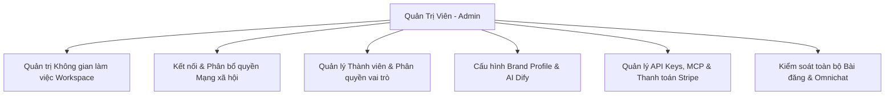

# Hướng Dẫn Dành Cho Quản Trị Viên (Admin)

Quản trị viên (Admin / Workspace Owner) là người chịu trách nhiệm cao nhất về cấu hình hệ thống, bảo mật dữ liệu, phân quyền nhân sự và tài chính của Workspace.

---

## Các Nhiệm Vụ Trọng Tâm Của Admin

### 1. Phân Bổ Quyền Truy Cập Kênh (Channel Assignments)
Nhằm ngăn chặn việc nhân viên đăng nhầm nội dung lên kênh không đúng thẩm quyền:
1. Vào **Cài đặt Workspace > Assignments**.
2. Chọn từng thành viên trong danh sách.
3. Tích chọn các tài khoản mạng xã hội mà nhân viên đó được phép nhìn thấy và đăng bài.
4. Nhấn **Lưu thay đổi**.

### 2. Thiết Lập Tiêu Chuẩn Thương Hiệu (Brand Voice)
1. Vào **Cài đặt Workspace > Brand Profile**.
2. Khai báo quy tắc xưng hô, giọng văn, bảng màu chuẩn và danh sách từ khóa cấm.
3. Toàn bộ nội dung sinh ra từ AI sẽ tự động tuân thủ cấu hình này.

### 3. Quản Lý Gói Cước & API Keys
- Quản lý hạn mức thành viên, số lượng kênh và chu kỳ thanh toán tại **Cài đặt Tài khoản > Billing**.
- Cấp phát API Keys cho các hệ thống bên ngoài tại mục **Cài đặt Workspace > API Keys**.
