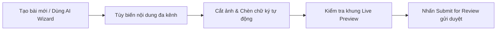

# Hướng Dẫn Dành Cho Chuyên Viên Nội Dung (Editor)

Chuyên viên nội dung (Editor / Content Creator) là người trực tiếp lên ý tưởng, sử dụng công cụ AI, soạn thảo bài viết và gửi phê duyệt.

---

## Quy Trình Làm Việc Tiêu Chuẩn

### Các Bước Thực Hiện:
1. **Khởi tạo nội dung:** Nhấp **Tạo bài viết mới** hoặc sử dụng **AI Post Wizard** để sinh nội dung tự động từ ý tưởng.
2. **Chọn kênh xuất bản:** Chọn các kênh được quản trị viên cấp quyền.
3. **Tùy biến đa kênh:** Tinh chỉnh tiêu đề và văn bản cho từng tab mạng xã hội tương ứng.
4. **Cắt ảnh thông minh:** Sử dụng công cụ cắt ảnh để đưa hình ảnh về tỷ lệ chuẩn của từng nền tảng (`1:1`, `16:9`, `9:16`, `4:5`).
5. **Gửi duyệt bài:** Nhấn **Submit for Review**. Sau khi gửi, bài viết sẽ ở trạng thái khóa chỉnh sửa để người duyệt thẩm định.
