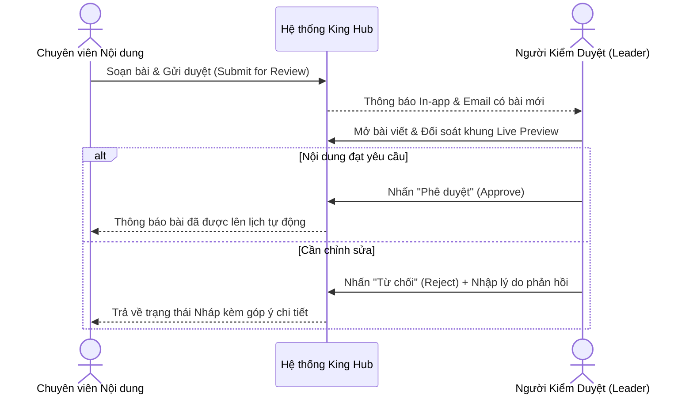

# Hướng Dành Cho Người Kiểm Duyệt (Reviewer)

Người kiểm duyệt (Reviewer / Content Leader / Đại diện Khách hàng) đóng vai trò thẩm định chất lượng nội dung, đảm bảo bài viết chuẩn xác về mặt thông điệp, hình ảnh và thời gian xuất bản trước khi ra công chúng.

---

## Hướng Dẫn Thao Tác Kiểm Duyệt

### Bước 1: Tiếp Nhận Bài Viết Cần Duyệt
- Truy cập danh sách **Bài viết > Chờ duyệt (Pending)** hoặc nhấp vào thông báo nhận được trên thanh tiêu đề.

### Bước 2: Đánh Giá Nội Dung & Kiểm Tra Định Dạng
1. Đọc kỹ văn bản, kiểm tra tính chuẩn xác của các liên kết và hashtag.
2. Kiểm tra khung **Live Preview** của từng nền tảng để đảm bảo hình ảnh không bị cắt sai tỷ lệ hoặc nội dung vượt quá giới hạn ký tự.
3. Sử dụng tab **Bình luận (Comments)** để tag `@tên_nhân_viên` trao đổi nội bộ nếu có điểm cần làm rõ.

### Bước 3: Đưa Ra Quyết Định
- **Phê duyệt (Approve):** Nhấp nút **Phê duyệt**. Bài viết sẽ chuyển thẳng sang trạng thái **Scheduled** (Đã lên lịch) hoặc xuất bản ngay nếu là bài đăng tức thì.
- **Từ chối (Reject):** Nhấp nút **Từ chối** -> Điền rõ lý do trong hộp thoại (ví dụ: *"Sửa lại giá bán, thay hình ảnh theo mẫu số 2"*) -> Bấm **Xác nhận**.
