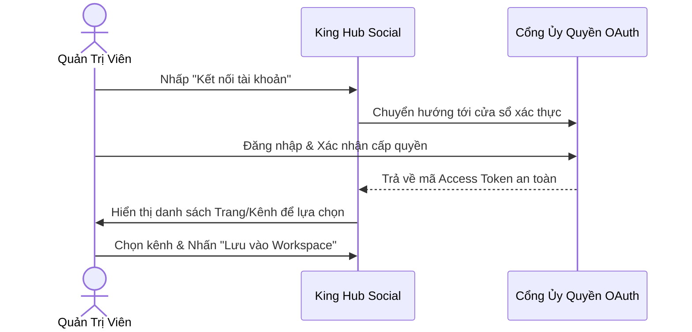

# Kết Nối 12+ Nền Tảng Mạng Xã Hội

King Hub Social tích hợp API chính thức của các nền tảng mạng xã hội hàng đầu thế giới, đảm bảo kết nối an toàn, bảo mật và tuân thủ chính sách nhà phát triển.

---

## Danh Mục Nền Tảng Hỗ Trợ

| Nền Tảng | Loại Tài Khoản Hỗ Trợ | Quyền Hạn Yêu Cầu | Định Dạng Bài Đăng |
| :--- | :--- | :--- | :--- |
| **Facebook** | Fanpage doanh nghiệp & Profile | Admin / Editor của Trang | Văn bản, Ảnh đơn/nhiều ảnh, Video, Link |
| **Instagram** | Business & Creator Account | Đã liên kết với Facebook Page | Ảnh đơn, Carousel (tối đa 10 ảnh), Reels |
| **Threads** | Tài khoản Threads | Đăng nhập tài khoản Instagram liên kết | Văn bản (tối đa 500 ký tự), Ảnh, Video |
| **TikTok** | Tài khoản Cá nhân & Doanh nghiệp | Xác thực qua TikTok Direct Post API | Video ngắn định dạng dọc (9:16) |
| **YouTube** | Kênh YouTube (Channel) | Tài khoản Google quản trị kênh | Video dài chuẩn (16:9), Shorts (9:16) |
| **LinkedIn** | Profile cá nhân & Company Page | Quyền Super Admin của Trang | Bài viết, Ảnh, Tài liệu PDF, Video |
| **X (Twitter)** | Tài khoản X | Xác thực qua Twitter API v2 | Tweet văn bản (280 ký tự), Ảnh, Video |
| **Pinterest** | Tài khoản Business | Có sẵn ít nhất 1 Bảng (Board) | Ghim (Pin) kèm hình ảnh, tiêu đề và link |
| **Bluesky / Mastodon** | Mạng xã hội phi tập trung | App Password / Instance domain | Bài viết văn bản, hình ảnh |
| **Telegram / Discord** | Kênh Telegram & Server Discord | Bot Token / Webhook URL | Tin nhắn, Ảnh, Thông báo tự động |

---

## Hướng Dẫn Kết Nối Mạng Xã Hội

1. Truy cập menu **Tài khoản mạng xã hội** (`/accounts`).
2. Chọn nền tảng muốn kết nối -> Nhấn **Kết nối**.
3. Cửa sổ xác thực mở ra -> Đăng nhập và xác nhận cấp quyền đầy đủ.
4. Chọn Trang/Kênh cần quản trị từ danh sách hiển thị -> Nhấn **Hoàn tất**.
